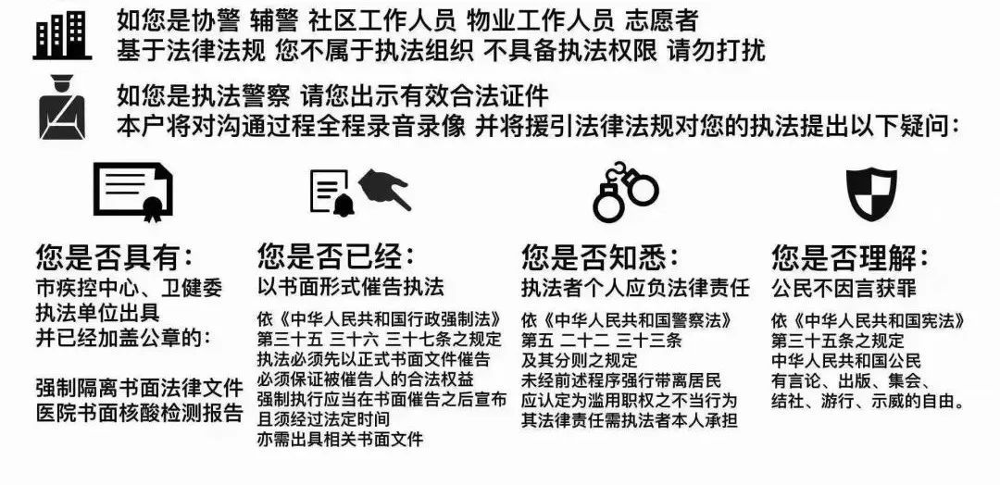

# 居委会是否封楼/"强制居家"/限制人身自由的权利？
* 1：居委会、村委会是居民自治机构，不属于政府行政机关，无权自主决定社区的防疫封控管理。

* 2：《中华人民共和国行政强制法》规定，限制公民人身自由的行政强制措施由法律设定。

《中华人民共和国行政处罚法》规定，限制人身自由的行政处罚权，只能由法律设定；限制人身自由的行政处罚权只能由公安机关行使。

* 3：《中华人民共和国传染病防治法》规定，省、自治区、直辖市人民政府可以决定对本行政区域内的甲类传染病疫区实施封锁；新冠病毒(COVID-19)及其他版本属于乙类。

* 4：居委会对小区执行封闭管理，需要出示相应的书面决定（必须加盖政府或者同级防控指挥部的公章），同时必须严格执行县级以上人民政府作出的封控决定，且不应超过国务院规定的防控限度。

* 5：《刑法》第二百三十八条：非法拘禁他人或者以其他方法非法剥夺他人人身自由的，处三年以下有期徒刑、拘役、管制或者剥夺政治权利。致人重伤的，处三年以上十年以下有期徒刑；致人死亡的，处十年以上有期徒刑。使用暴力致人伤残、死亡的，依照本法第二百三十四条、第二百三十二条的规定定罪处罚。

* 6：《宪法》第三十七条：公民的人身自由不受侵犯；禁止非法拘禁和以其他方法非法剥夺或者限制公民的人身自由

* 7：《刑法》第二十一条：为了使本人或者家人的人身、财产和其他权利免受正在发生的危险，不得已采取的紧急避险行为，造成损害的，不负刑事责任。

# 与非法封控人员无法正常沟通怎么办？
建议您将以下图片打印一式多份并进行保管。

# 面对暴力封楼、焊门、电磁锁导致无法紧急避难怎么办？
建议家中常备一些灭火器、防火服、绳索、老虎钳、电锤、切割机、撬棍、铁锤、板斧等应急工具。

来源：中国数字时代
* https://chinadigitaltimes.net/chinese/690211.html